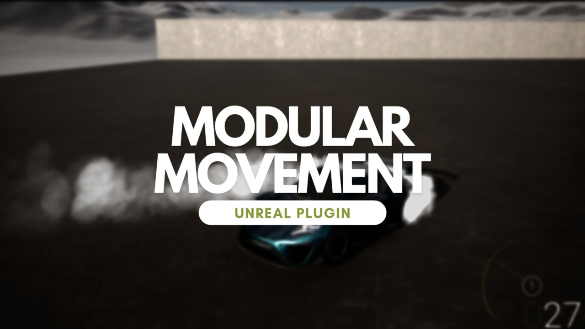
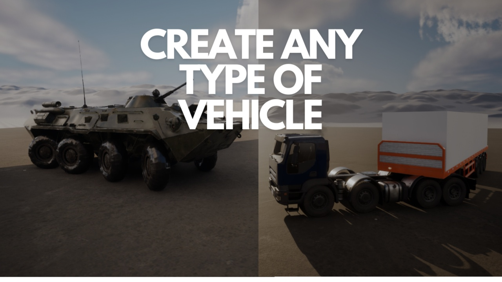
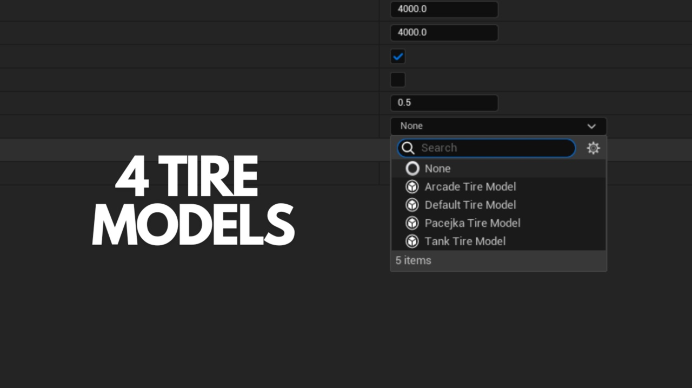
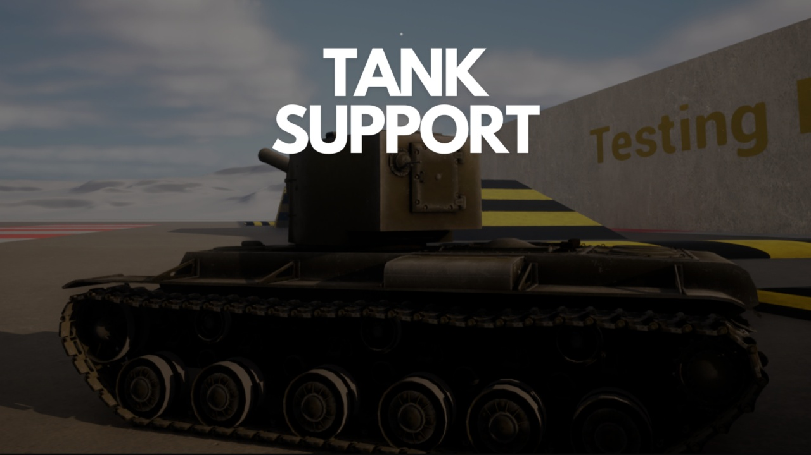
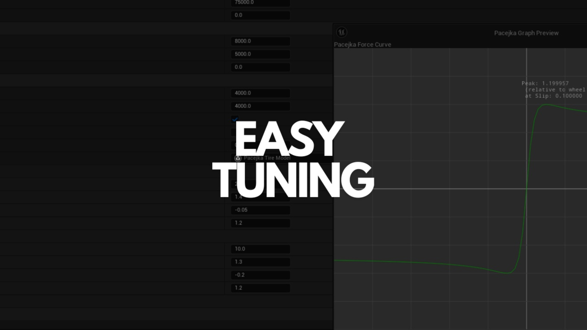

# Modular Movement Plugin for Unreal Engine 5

**Overview** | [ MarketPlace Version ](https://www.fab.com/listings/4ffb079a-52ff-4098-b27a-492701886ee7)| [Docs](https://irajsb.github.io/ModularMovementDocs/) | [Discord](https://discord.gg/E9M2tFQyyD) | [Watch Video](https://youtu.be/AkCEN7WajNw) | [Example Project 5.4](https://github.com/irajsb/ModularVehicles)

The **Modular Movement Plugin** enhances Unreal Engine 5 with flexible, realistic vehicle simulations. Ideal for racing games, open-world adventures, or military sims, it delivers immersive vehicular gameplay.

## Key Features
- **Modular Design**: Works with any kind of mesh.
- **Modular Design**: Reusable engine, gearbox, and wheel Components for efficient vehicle creation.
- **Realistic Tire Models**: Choose from default, Pacejka, arcade, or tank models for precise handling.
- **Dynamic Wheel Updates**: Adjust wheel parameters in real-time for responsive gameplay.
- **Tank Support**: Individual track mechanics for realistic tank movement.
- **Basic AI Support**: Easily integrate AI-controlled vehicles with customizable behavior. (Experimental)
- **SI Units for Suspension**: Accurate suspension calculations using SI units.
- **Wheel Attachments**: Connect wheels to trailers or other components for complex setups.
- **Advanced Debugging**: Visualize key parameters with debugging tools and graphs.
- **Differential Support**: Options for AWD, Diff lock, and LSD for enhanced handling.
- **Physical Constraint Wheels**: Realistic wheel-environment interactions for authentic physics.

---
|       |  |
| ----------- | ----------- |
|| |
| ||

---
